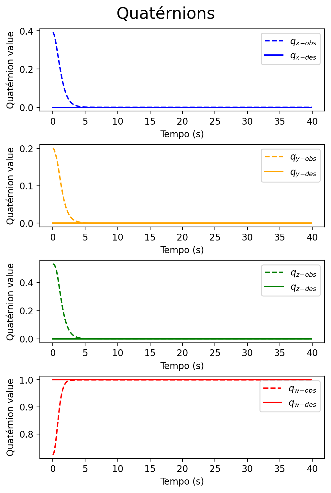
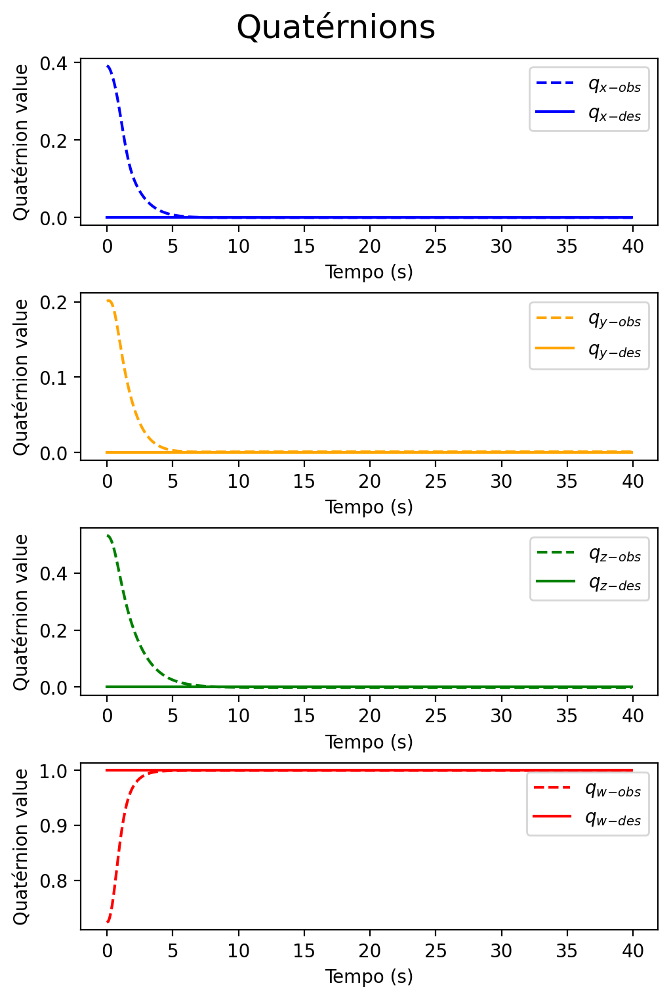

# RL_ADCS
This repository is tracking my undergraduate thesis work in electrical engineering.
### Requirements :
This project was created and tested using the following settings :
```
Python 3.8.18
Ubuntu 22.04.3
python package ml-agents 0.28.0
unity ml-agents 2.2.1
```

### Enviromment

To perform the attitude control of a satelite in space, we usually apply torques on its axes so that it is placed in the desired orientation. To apply torque are commonly used reaction wheels.
<p align="center">
  
</p>
<p align="center">
</p>
It was considered a simplified assembly with 3 reaction wheels aligned to the main axes of the satellite, as shown in the figure below.
<p align="center">
  
</p>
<p align="center">
</p>

### Agent

To perform the training was used as input information the quaternion of the current attitude of the satellite (size 4), the quaternion of the desired attitude (size 4), the quaternion of the attitude error (size 4) and the angular speed (size 3) of the satelite in the three axes.

As a result in the output layer of the neural network we have a vector (size 3) with values that are multiplied by a constant to convert into torque.

### Results :
#### Training
The PPO method was used for agent training, the result of the mean cumulative reward during training can be observed below:
<p align="center">
  
</p>
<p align="center">
</p>

#### Test Episode
Below can be observed the pointing peformance of the satellite being controlled by the neural network (on the right side) and the PD controller (on the left side). The continuous lines represent the desired orientation, while the dashed lines represent the orientation of the satelite.

  

### https://github.com/AntonioClaudiossf/RL_ADCS/results/videos/

